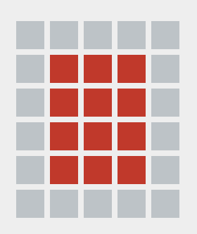

# Crazy Layouts Generator Using Css Grid

layout generator for web pages.

------------

------------

## Instructions

1. select the number of rows and columns.
2. use the colors for separate the panels.
3. the cells with the same color will be a panel.
4. the white color wil be an empty space.
5. bellow will be appear the html code corresponding to the generated layout

------------

## warnings

- ### only set square layouts .
dont :

do:

- ### Don't use the same color on separate regions .
dont:

do:

